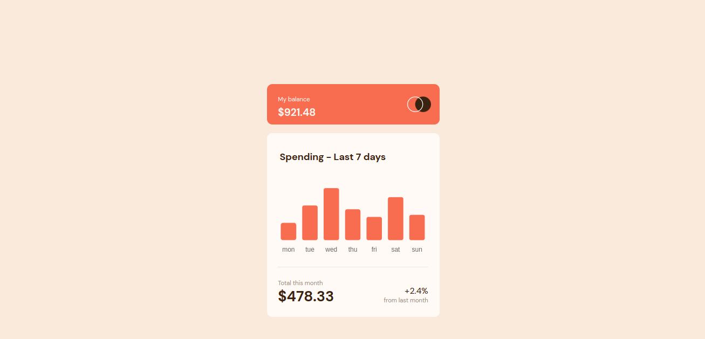

# Frontend Mentor - Expenses chart component solution

This is a solution to the [Expenses chart component challenge on Frontend Mentor](https://www.frontendmentor.io/challenges/expenses-chart-component-e7yJBUdjwt). Frontend Mentor challenges help you improve your coding skills by building realistic projects. 

## Table of contents

- [Overview](#overview)
  - [The challenge](#the-challenge)
  - [Screenshot](#screenshot)
  - [Links](#links)
- [My process](#my-process)
  - [Built with](#built-with)
  - [What I learned](#what-i-learned)
  - [Continued development](#continued-development)
  - [Useful resources](#useful-resources)
- [Author](#author)
- [Acknowledgments](#acknowledgments)

## Overview

### The challenge

Users should be able to:

- View the bar chart and hover over the individual bars to see the correct amounts for each day
- See the current day’s bar highlighted in a different colour to the other bars
- View the optimal layout for the content depending on their device’s screen size
- See hover states for all interactive elements on the page
- Use the JSON data file provided to dynamically size the bars on the chart

### Screenshot

### Links

- Solution URL: (https://github.com/Mlowegene/Expenses-Chart-Component)
- Live Site URL: (https://mlowegene.github.io/Expenses-Chart-Component/)

## My process

### Built with

- Semantic HTML5 markup
- CSS custom properties
- Flexbox
- Javascript

### What I learned

I have learned to use chart.js Library to create bar chart, that was new experience, also i have learned to interact wit JSON file.

### Useful resources

- [Resource 1](https://www.chartjs.org/docs/latest/) - This Chart.js Documentation helped me to style my bar chart. I really liked this pattern and will use it going forward.
- [Resource 2](https://www.w3schools.com/ai/ai_chartjs.asp) - This is an amazing article which helped me finally to know there is library for different chart. I'd recommend it to anyone still learning this concept.

## Author

- Website - [Mlowegene](https://github.com/Mlowegene)
- Frontend Mentor - [@Mlowegene](https://www.frontendmentor.io/profile/Mlowegene)
- Twitter - [@genemlowe](https://www.twitter.com/genemlowe)
- LinkedIn - [Generation Mlowe] (https://www.linkedin.com/in/generation-mlowe-441713240/)
